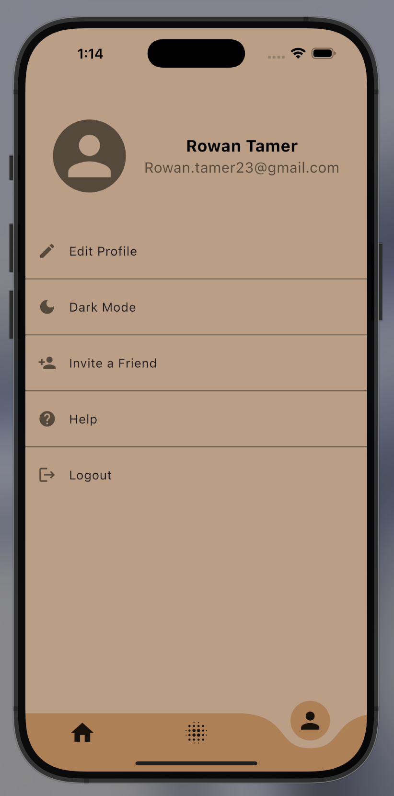

# 📊 Tracker - Flutter Habit & Progress Tracking App

A beautiful and intuitive Flutter application for tracking habits, goals, and personal progress with stunning visualizations and analytics.

## 📱 App Preview

  
  

*Replace with your actual app screenshots*

## ✨ Features

### 🎯 Habit & Goal Tracking
- **Daily Habit Tracking**: Log and monitor daily routines and habits
- **Goal Setting**: Set and track progress towards personal goals
- **Progress Visualization**: Beautiful circular progress indicators and charts
- **Streak Tracking**: Maintain motivation with streak counters

### 📊 Analytics & Insights
- **Progress Analytics**: Detailed insights into your tracking history
- **Statistics Dashboard**: Visual representations of your progress
- **Achievement System**: Unlock milestones and achievements
- **Trend Analysis**: Identify patterns in your habits

### 🎨 User Experience
- **Modern UI/UX**: Clean, material design inspired interface
- **Dark/Light Theme**: Full support for both themes
- **Responsive Design**: Optimized for both iOS and Android
- **Intuitive Navigation**: Easy-to-use tab-based navigation

### 💾 Data Management
- **Local Storage**: Secure local data persistence
- **Data Export**: Export your progress data
- **Backup & Restore**: Safeguard your tracking history
- **Offline Functionality**: Works completely offline

## 🛠️ Technical Stack

- **Framework**: Flutter 3.19+
- **Language**: Dart 3.1+
- **State Management**: Provider/Riverpod
- **Local Database**: Hive for fast, local storage
- **Navigation**: Flutter Navigator 2.0
- **UI Components**: Custom widgets with Material Design
- **Charts & Graphs**: Custom progress visualizations
